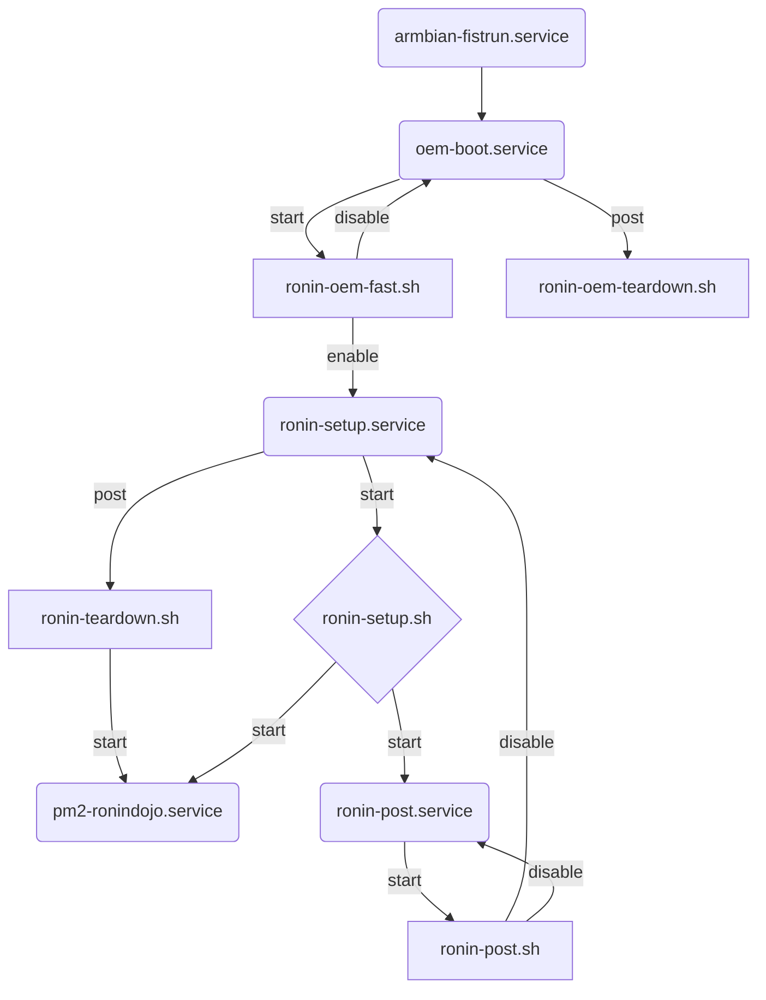

<br>

***Welcome tinkerer, coder, maker, builder and FOSS-lovin’ cypherpunk!***
<br>
_Welcome to:_


## RoninOS

With this readme, you’ll learn about how to make your own builds of RoninOS,
utilising the scripts in this repo.


### TL;DR: How to make a build

1) Prepare [Ubuntu Jammy](https://www.releases.ubuntu.com/jammy/ubuntu-22.04.2-live-server-amd64.iso) as an Armbian build environment following this guide:<br>
   https://docs.armbian.com/Developer-Guide_Build-Preparation/
2) This includes cloning the [Armbian build repository](https://github.com/armbian/build) into your user’s home directory:<br>
  `cd ~`<br>
  `git clone --depth=1 --branch=main https://github.com/armbian/build`
3) Clone also the RoninOS repo into your user’s home directory:<br>
  `git clone https://code.samourai.io/ronindojo/RoninOS`
4) Run the RoninOS staging script first:<br>
  `cd ~/RoninOS`<br>
  `./01-stage-ronin-os.sh`<br>
5) Also in `~/RoninOS`, start the script for triggering the compiling process:<br>
  `./02-compile-ronin-os.sh`
6) An interactive list appears, for you to be able to select your desired target board
7) After the building process (≈30 min), find your image in `~/build/output/images/`


<br>


> ### Table of contents
>
> 0. [TL;DR: How to make a build](#tldr-how-to-make-a-build)<br>
> 1. [At length: Building and running RoninOS](#1-at-length-building-and-running-roninos)<br>
> 	1.1 [What is RoninOS](#11-what-is-roninos)<br>
> 	1.2 [Prerequisites](#12-prerequisites)<br>
> 	1.3 [Preparing the build environment](#13-preparing-the-build-environment)<br>
> 	1.4 [Making edits to customise your build](#14-making-edits-to-customise-your-build)<br>
> 	1.5 [Starting the build process](#15-starting-the-build-process)<br>
> 	1.6 [Running RoninOS](#16-running-roninos) / [Flowchart of first run](#16-running-roninos)<br>
> 2. [Resources](#2-resources)<br>

<br>

### 1. At length: Building and running RoninOS

#### 1.1 What is RoninOS

RoninOS is a flavoured Armbian with automatic installation of RoninDojo and interrelated tools 
to run a privacy focussed Bitcoin node on a variety of [single-board computers](https://en.wikipedia.org/wiki/Single-board_computer) (SBC). 
It’s Free and Open-Source Software, licensed under the [GNU AGPL3](https://code.samourai.io/ronindojo/RoninOS/-/raw/master/LICENSE.txt).

<br>

#### 1.2 Prerequisites

RoninOS makes certain presumptions. Make sure they are met, otherwise the build can not
operate as intended and thus fail during the setup process on first run. Your machine is then most likely
in an undesirable state and it would be best to reflash your boot drive with your built image to start clean.

- Have an SBC capable of running Armbian; in other words: Armbian must be available for your SBC.
 Get a glimpse on which boards are compatible with Armbian [here](https://github.com/armbian/build/tree/main/config/boards).
- Your SBC needs two drives: a small drive (>=4 GB) for RoninOS and a big drive (>=1 TB) for data storage.
  - The small drive needs to be a block device, eMMC or SD card (occupying `/dev/mmcblkX`) to boot from. It must **not** be a bootable USB thumb drive, occupying `/dev/sda1`.
  - The big drive is recommended to be an M.2 SSD (occupying `/dev/nvme0n1`) or an external USB drive (occupying `/dev/sda1`).
- The SBC must be connected to your local ethernet and have internet access available.

The other big presumption is: **you know what you’re doing and/or you’re ready to learn.**

<br>

#### 1.3 Preparing the build environment

RoninOS is based on Armbian, a Debian fork specialised to run on small SBCs.
Therefore we need to follow the Armbian build guide to make our build of RoninOS.
Basically we use Ubuntu Jammy (x86_64 / amd64) to cross-compile Armbian for [ARM](https://en.wikipedia.org/wiki/ARM_architecture_family)-based platforms (arm64).

Armbian build guide: https://docs.armbian.com/Developer-Guide_Build-Preparation/

1) Prepare [Ubuntu Jammy 22.04.x](https://www.releases.ubuntu.com/jammy/ubuntu-22.04.2-live-server-amd64.iso) as a base operating system; either native or in a VM.
A VM should have at least 4 GB of RAM and 32 GB of disk space (more is better). You can use tools like [VMware Workstation Player](https://www.vmware.com/in/products/workstation-player/workstation-player-evaluation.html) (Win, Linux) 
or [Oracle VM VirtualBox](https://www.virtualbox.org/) (Win, Mac, Linux).
2) Make sure your VM or your native system has correct internet access. **Note:** If you handle your internet access through a VPN service, you most likely will run
into trouble Ubuntu not finding the correct package lists and mirrors for your region due to a DNS error (due to funky Debian load balancing). So during build time and when `apt-get`’ing, you might want to disable the VPN connection – or
take great care that Ubuntu and Armbian can find all required dependencies.
3) Run `sudo apt-get update` and `sudo apt-get upgrade` to update your whole system first.
4) If not already present, install Git:<br>
   `sudo apt-get -y install git`
5) Clone the [Armbian build repository](https://github.com/armbian/build) into your user’s home directory:<br>
   `git clone --depth=1 --branch=main https://github.com/armbian/build`<br>
   You will gain a new directory named `build`.
6) Clone the RoninOS repository into your user’s home directory:<br>
   `git clone https://code.samourai.io/ronindojo/RoninOS`<br>
   You will gain a new directory named `RoninOS`
7) Change directory to `RoninOS` with:<br>
   `cd ~/RoninOS`
8) In `RoninOS` run the staging script:<br>
   `./01-stage-ronin-os.sh`<br>
   This will copy the necessary files from `RoninOS` to the Armbian `build/userpatches` and `build/userpatches/overlay` directories.


The RoninOS files are now in position to build a Ronin-flavoured Armbian. Before actually building an image
you can now make edits to the files should you wish to customise your build.

<br>

#### 1.4 Making edits to customise your build

**1.4.1** A very important file for customising your build is `customize-image.sh`. It resides in `~/build/userpatches/`.
It runs during build time and prepares certain settings and packages to be present in the image. So examine and edit this file:


```
~/build/userpatches/customize-image.sh
```


It may be desirable to preset your preferred keyboard layout (`KEYMAP`) and time zone (`TIMEZONE`) for the target machine.


**Tip:** To make browsing and editing files much easier, do yourself a favour and install [Midnight Commander](https://en.wikipedia.org/wiki/Midnight_Commander) 
into your build environment: `sudo apt-get -y install mc`.


**1.4.2** Another important file for customizing your image is `ronin-setup.sh`. It resides in `~/build/userpatches/overlay/RoninOS/overlays/RoninOS/usr/local/sbin/`.
It is called during first run (and on normal boot time) of your machine. It installs additional packages and configures your system as soon as it’s live.
So you might want to examine and edit this file:

```
~/build/userpatches/overlay/RoninOS/overlays/RoninOS/usr/local/sbin/ronin-setup.sh
```


**1.4.3** Also have a glance at the [Armbian Developer Guide](https://docs.armbian.com/Developer-Guide_Build-Options/) to dive deeper into the options
the compiler parameters might give you.


<br>

#### 1.5 Starting the build process

To start the build process, execute `./02-compile-ronin-os.sh` inside of `~/RoninOS`:

`cd ~/RoninOS`<br>
`./02-compile-ronin-os.sh`


This basically calls the Armbian compile script (`~/build/compile.sh`) with a couple of parameters important for building RoninOS:

```
./compile.sh 
	KERNEL_CONFIGURE=no
	BRANCH=current
	RELEASE=bullseye
	BUILD_DESKTOP=no
	BUILD_MINIMAL=yes
	HOST=ronindojo
	BOARD=
```


Note that `BOARD` is left unset – this will let an interactive list appear from which you can select your desired target board.
If you know which board you want to build for, you can also preset `BOARD` with the appropriate [config name](https://github.com/armbian/build/tree/main/config/boards)
by editing `02-compile-ronin-os.sh`. Default for the Tanto is `BOARD=rockpro64`.


You can also call Armbian’s `./compile.sh` directly – this will make a multi-stage interactive list appear, where you can select all the options otherwise
provided by the parameters. **But keep in mind:** whichever method you choose, make sure you still provide `HOST=ronindojo` as a parameter to the compile script `compile.sh` – it’s important to
 preset the `hostname` of your target machine, which must be set to `ronindojo`. Long story short: it is much better to use `02-compile-ronin-os.sh` to save time
and to not make any mistakes by accident.


The build process will automatically run with `sudo`, therefore will ask you to provide the sudo password.


When building for the first time, a lot of packages will be downloaded and installed. Depending on your internet connection,
this process will take at least 30 min, probably much more. Future build processes will take a little less time.
Also you can try to make use of the caching feature by utilising the build option [`CLEAN_LEVEL`](https://docs.armbian.com/Developer-Guide_Build-Options/) and
adding it as a parameter in `02-compile-ronin-os.sh`.


After a successful build process, you will find your image file in `~/build/output/images/`.


<br>

#### 1.6 Running RoninOS

1) Flash your image to your desired boot drive of your board – this is usually an SD card or an eMMC module or chip.
Use tools like [Rufus](https://rufus.ie/en/) (Win), [Balena Etcher](https://etcher.balena.io/) (Win, Mac, Linux) 
or simply [dd](https://www.makeuseof.com/tag/easily-clone-restore-linux-disk-image-dd/) (Linux) for this.
2) Have your storage drive (M.2 SSD recommended) assembled and connected to your board.
3) Plug in the ethernet cable.
4) **Then** switch on power to boot the machine.
5) RoninOS boots and installs RoninDojo and additional tools. It makes downloads from the internet to do that.

**Flowchart of first run**



Usually it’s intended to simply wait a couple of minutes until RoninOS has installed all the packages during first boot
and advertises the `ronindojo.local` domain in your network.
You can then connect via any browser on any device in your network (desktop recommended) to RoninUI made available to you.
Should `ronindojo.local` not be provided, use the local IP address of this device – you can find out which IP address was handed by DHCP to it,
by skimming in your router’s section of the currently connected devices. It’s common to find an IP address in the form of `192.168.xxx.xxx` in local networks.
 
From here, refer to the RoninDojo Wiki page to find your way around RoninUI: https://wiki.ronindojo.io/en/setup/ronin-ui.
 
While accessing your node via RoninUI in a browser or SSHing into it is the norm, you can, however, 
also have monitor, keyboard and mouse plugged in to work locally on this machine, should you so desire (and your board has the appropriate connectors).


<br>


### 2. Resources

- GNU AGPL3 licence: https://code.samourai.io/ronindojo/RoninOS/-/raw/master/LICENSE.txt
- Armbian compatible boards: https://github.com/armbian/build/tree/main/config/boards

- Armbian build guide: https://docs.armbian.com/Developer-Guide_Build-Preparation/
- VMware Workstation Player: https://www.vmware.com/in/products/workstation-player/workstation-player-evaluation.html
- Oracle VM VirtualBox: https://www.virtualbox.org/

- Linux Bash manual: https://help.ubuntu.com/community/Beginners/BashScripting

- Rufus: https://rufus.ie/en/
- Balena Etcher: https://etcher.balena.io/
- `dd` command: https://www.makeuseof.com/tag/easily-clone-restore-linux-disk-image-dd/

- RoninDojo Wiki page: https://wiki.ronindojo.io/en/setup/ronin-ui


<br>

----


If any changes occur moving forward, this repo will be updated.

